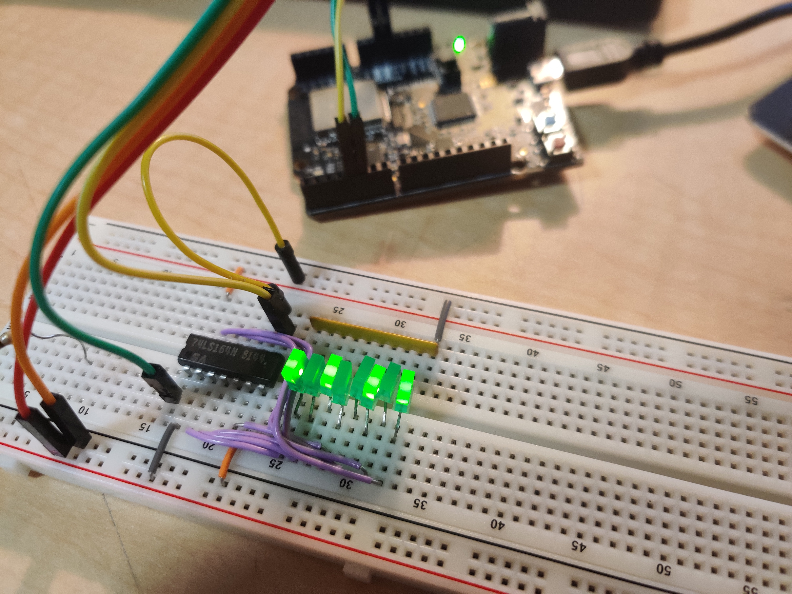

## RISC-V Software Serial

A software based implementation of a serial communication protocol. When connected to an 8-bit shift register, only two wires are required to send bytes of information, one data wire and one clock wire.

